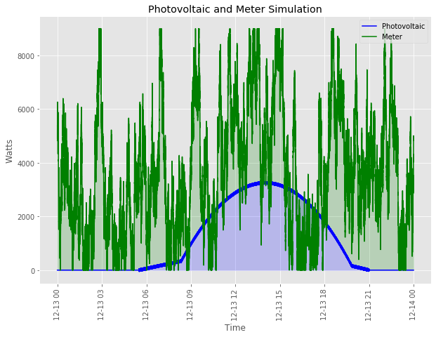
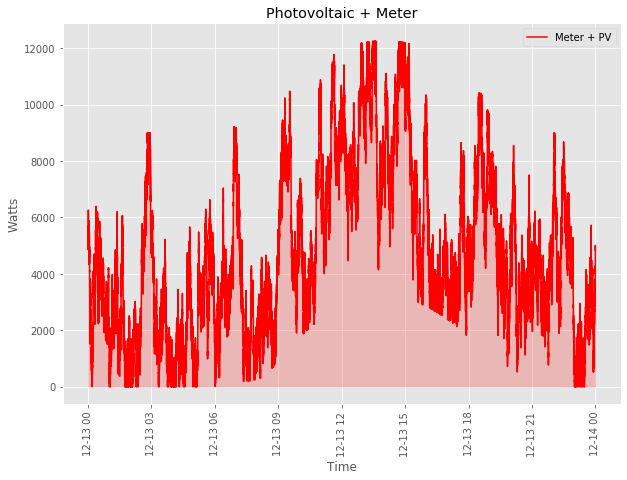

# Photovoltaics Simulator Challenge
In this repository, a brief simulation of photovoltaic power values is implemented. There are mainly 3 components:
  * Meter
  * Photovoltaics
  * Message Broker (RabbitMQ)

## 1. General Process
### 1.1 Initialization of Modules
Initially, meter sends an initialization message to the photovoltaics module (PV). This message contains a __file_name__
variable and informs the PV to initialize a file with the name __file_name__ with a predefined content.

## 1.2 Start Simulation
Every second, a watt value is read in the meter.py, which should reflect the power consumption of a house. 
Then the meter sends this watt value and its timestamp to the photovoltaic module (PV). PV (which already listens the 
meter) gets this info, samples a watt value (power generated by the PV) from a predefined distribution with the timestamp
parameter. Then this data is appended to the file __file_name__.

## 2. Setup Your System
Please a Ubuntu computer, all the development is done on a Ubuntu 16.04 environment. Other OS's are not tested.

* RabbitMQ server should be set up and running.

    To setup, see [RabbitMQ Guide](https://www.rabbitmq.com/download.html).
    
    Later, start the service with:
     
    ```
    sudo service rabbitmq-server start
    ```
* Go into the project directory, and install the pip dependencies with
    ```
    pip install -r requirements.txt
    ```
  
## 3. Run The Notebooks
Open the notebooks __Meter_Simulator.ipynb__ and __PV_Simulator.ipynb__ .

In the notebook PV_Simulator, run until the code:
```python
 pv.listen_queue()
```
This will have the execution wait for the incoming messages. 
__Note__: This waiting could be stopped with an interrupt to the notebook. Or, a message (of the type dictionary in Python) 
with the key: __m_type__ equals to __1__ will stop the this waiting by running `.stop_consuming()` method in channel.

Then, in the notebook Meter_Simulator, after running package imports and __Setup Parameters__ sections,
one can choose what type of simulation is preferred. The first one is slow and the other one is quick simulation.

  * __Slow Simulation__: Starting from the current time, the meter value is read and sent to the PV, each second.
  * __Quick Simulation__: The timestamps of each second for a day with the corresponding meter value is generated, and 
      those are sent to the PV quickly.
 
If __slow simulation__ is preferred, the code after the __Setup Parameters__ until the __Quick Simulation__ section could be run.

If __quick simulation__ is preffered, after runnning __Setup Parameters__, the __Quick Simulation__ section should be run.

When the simulation ends (with m_type=1), the waiting for new messages in PV_Simulator ends.

## Visualization

To see the simulated values, go into the __PV_Simulator__ notebook's __Visualize__ section. Assign file name of the 
csv file to be visualized to the variable `output_file_name` and run the cell. 

Example visuals are as follows:





